# Prince of Persia 1 Special Events

*a must-read for amateur mod creators*

August 7, 2015

> [!NOTE]
> This document is a faithful Markdown conversion of the **Prince of Persia 1
> Special Events** PDF (4th version, August 7, 2015) by the Prince of Persia
> modding community. The original is published at
> [popot.org](https://www.popot.org/documentation/documents/2015-08-07_PoP1_Special_Events.pdf).
> The screenshots in `images/` were extracted from that PDF. Like the original,
> this document is licensed under the GNU Free Documentation License (see
> [License](#license)).

## Contents

- [Preamble](#preamble)
- [License](#license)
- [1. Level 1](#1-level-1)
  - [1.1 Falling Entry](#11-falling-entry)
  - [1.2 Tile Activation](#12-tile-activation)
- [2. Level 3](#2-level-3)
  - [2.1 Checkpoint](#21-checkpoint)
  - [2.2 Skeleton](#22-skeleton)
- [3. Level 4](#3-level-4)
- [4. Level 5](#4-level-5)
- [5. Level 6](#5-level-6)
- [6. Level 7](#6-level-7)
- [7. Level 8](#7-level-8)
- [8. Level 12a (12)](#8-level-12a-12)
  - [8.1 Tile Change](#81-tile-change)
  - [8.2 Shadow Appears](#82-shadow-appears)
  - [8.3 Tiles Appear](#83-tiles-appear)
  - [8.4 Next Section](#84-next-section)
- [9. Level 12b (13)](#9-level-12b-13)
  - [9.1 Falling Tiles](#91-falling-tiles)
  - [9.2 Meeting Jaffar](#92-meeting-jaffar)
  - [9.3 Jaffar's Death](#93-jaffars-death)
- [10. Final Level](#10-final-level)
- [11. Potions Level](#11-potions-level)
- [12. Demo Level](#12-demo-level)
- [Afterword](#afterword)
- [Credits](#credits)

## Preamble

This document describes all the special events that take place in Prince of
Persia 1, when they are triggered and at what locations. It is possible to
customize these events with, for example, CusPop,[^1] by altering the
`PRINCE.EXE` file. This document describes the characteristics of the events
when aforementioned file has *not* been changed. This knowledge can be used to
change levels in such a way that the events still take place, but with different
results or at (seemingly) different locations.

This is the fourth version of this document, so it should be fairly complete by
now. In case you find a mistake or have a suggestion, please let us know.[^2]

## License

Copyright © 2012 - 2015 Prince of Persia modding community

Permission is granted to copy, distribute and/or modify this document under the
terms of the GNU Free Documentation License, Version 1.3 or any later version
published by the Free Software Foundation; with no Invariant Sections, no
Front-Cover Texts, and no Back-Cover Texts.

## 1. Level 1

### 1.1 Falling Entry

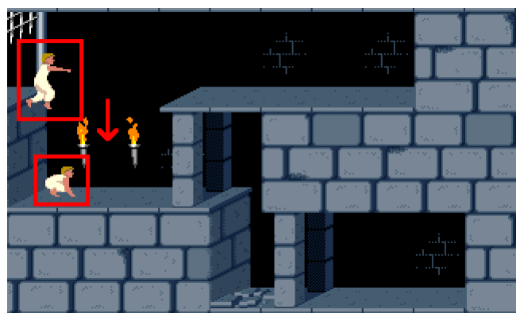

The player makes a falling entry and starts without his sword. The first time
the player crouches, a tune is played. In this context, the (painful) two-story
drops do *not* count as crouching.

### 1.2 Tile Activation

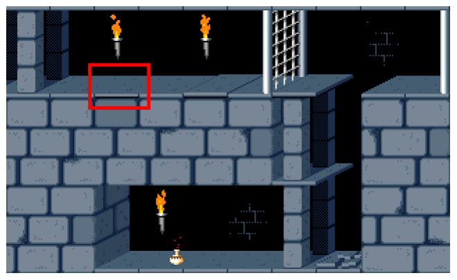

When level 1 begins, in **room 5**, the **3rd tile from the upper left** is
automatically being activated. The result of that trigger depends on the tile. A
spike will come out, then go back. A closed gate will open. An open gate will
soon close. Drop and raise tiles are being pushed. A loose tile will drop. A
chomper will chomp once (or more, if the player is near the chomper). An exit
door will open (if the player is not in room 5).

## 2. Level 3

### 2.1 Checkpoint

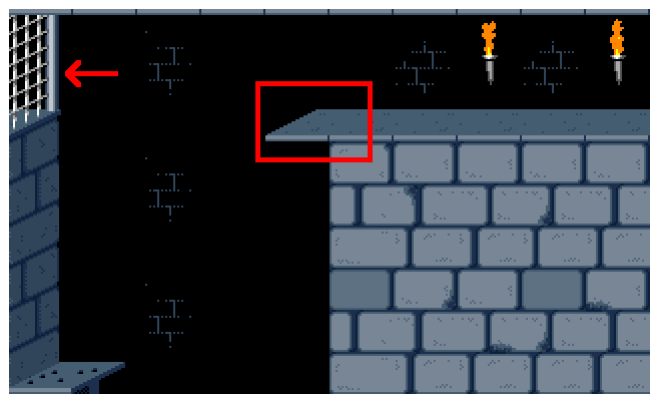

Level 3 has a checkpoint. If the player dies *after* having reached this point,
he or she will respawn — come back to life — at the checkpoint and doesn't have
to restart the level. The checkpoint is being activated when the player
**leaves room 7 to the left**.

When the player dies and respawns at the checkpoint, the game will automatically
remove the **5th tile from the upper left** in **room 7**.

The closing sound of gates in **room 2** can be heard from all rooms, regardless
their locations within that room.

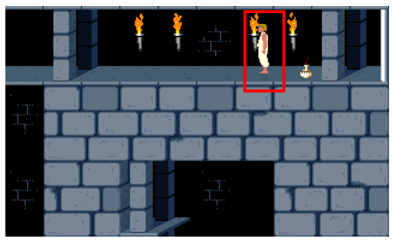

A player that dies *after* having reached the checkpoint, will respawn in
**room 2**, on the **4th tile from the upper right**, facing left.

### 2.2 Skeleton

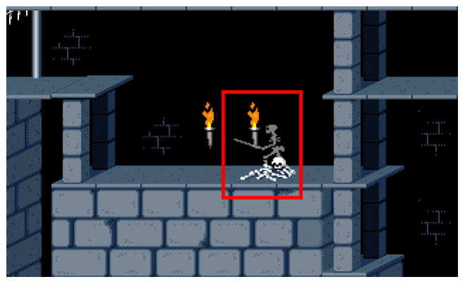

In level 3, if the level exit door has been raised, a skeleton will come alive
if the player touches the **3rd or 4th tile from the left**, in **any row**.
This only happens to the skeleton that is in **room 1**, in the **middle row**,
on the **5th tile from the right**.

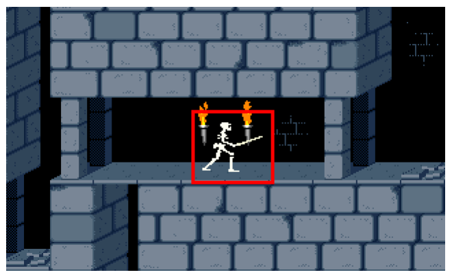

If *any* skeleton **falls into room 3**, it will reappear in **room 3**, in the
**middle row**, on the **5th tile from the left**, facing right.

## 3. Level 4

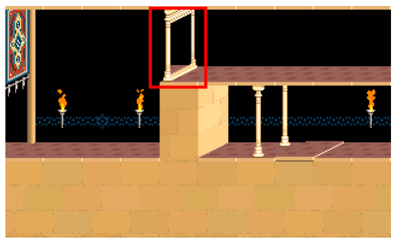

In level 4, if the level exit door has been fully raised, a mirror will be
*placed*. This mirror actually *becomes visible* when the player reenters
**room 4** *or* when the player moves onto the mirror's location. The mirror's
location is in aforementioned room, on the **5th tile from the top left**. A
tune is played when the player exits room 11 from the top left the first time
after the level exit door has been fully raised, and a different tune than usual
is played when the player exits the level or dies.

Also, if the level exit door has been fully raised, a tile in **room 4** will
transform.[^3] The location of the tile that transforms is the same as the
location of the left side of the level exit door that has been raised. If the
prince is in room 4 when the transformation takes place, the changes will
*become visible* when the player reenters the room or moves onto the tile's
location.

When the prince jumps through the aforementioned mirror, the image of the shadow
is clipped at x-coordinate 137. If there is a mirror in any row but *to the
right* of column 5, the shadow appears partly behind (left of) the mirror. If
there is a mirror in any row but *to the left* of column 5, the shadow appears
later than usual — when he reaches x-coordinate 137.

## 4. Level 5

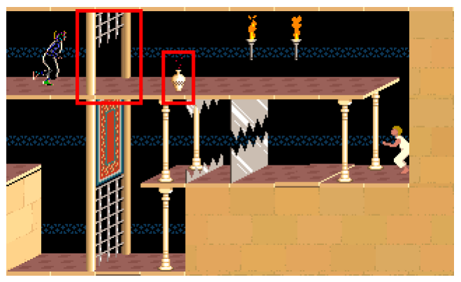

In level 5, the shadow drinks a potion if certain conditions are met. There has
to be an open gate in **room 24**, on the **2nd tile from the upper left**.[^4]
(It may be closed at first and opened later.) Also, a potion — it doesn't matter
which one — has to be in the same room, on the **4th tile from the upper left**.
The shadow will drink whatever potion is in aforementioned room on the **4th or
3rd tile from the upper left**, provided that he can in fact reach the potion.

When the prince enters **room 24**, the shadow is already being placed
(off-screen). If there is no floor under the shadow, he falls. If the prince
drinks the potion and then opens the gate, the shadow will *still* come,
*unless* the prince accesses a room with a guard before he opens the gate.

## 5. Level 6

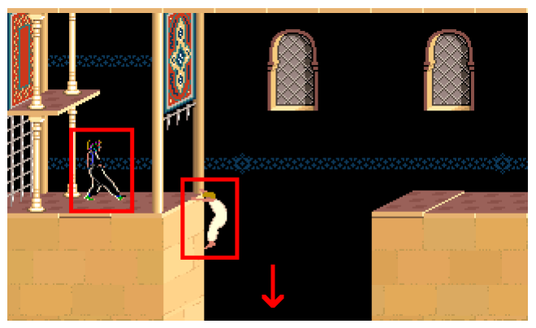

In level 6, the shadow will appear in **room 1**, in the **middle row**, on the
right side of the **1st tile from the left**, facing right. The shadow will
usually *step* forward after the player has almost completed a four-tile jump.
If there is a potion or sword on the **2nd tile from the left** in the **middle
row**, the shadow will *crouch* forward.[^5] The player's four-tile jump can be
in any row and should end on one of the first five tiles from the left. This
event will trigger *no matter what* tiles are being used in the room.

A tune is played when the player first enters **room 1**. After that tune, the
prince can use *any* level exit door.[^6] Exiting **room 1** at the bottom
starts level 7, regardless what room — if any — is below it.

If a level exit door is being used, it should be fully open *before* the prince
enters **room 1**. If the level exit door is only partially open, it will get
stuck.

## 6. Level 7

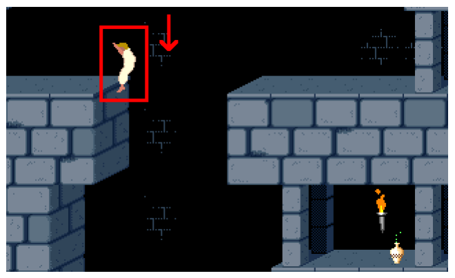

The player makes a falling entry. This only works if the player starts in
**room 17**, in the **bottom row**. If the player starts in room 17, but *not*
in the bottom row, an integer overflow will occur.[^7]

## 7. Level 8

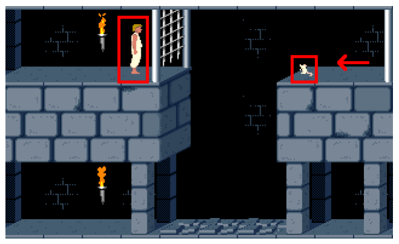

In level 8, if the level exit door has been raised, a mouse will appear in
**room 16**. The mouse will only appear if the player has been in aforementioned
room a *total* of 12.5 seconds. (So, it does *not* have to be continuous.) The
mouse will move from the top right towards the **3rd tile from the top right**
and then back.

## 8. Level 12a (12)

### 8.1 Tile Change

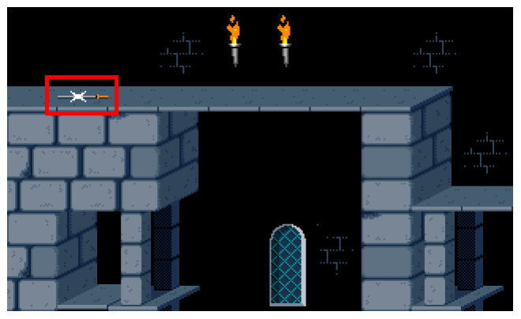

A tile in **room 15** of level 12a (12) changes into a regular platform when the
player **leaves room 18 to the right**. The tile in question is the **2nd tile
from the top left**.

### 8.2 Shadow Appears

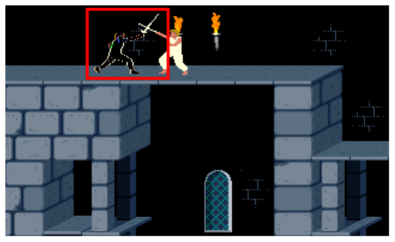

The shadow appears to fight the player in **room 15**. This only happens if
there is no sword on the **2nd tile from the top left**. The shadow appears when
the player first walks on **any of the six tiles from the left**, regardless
what row. Also, if the sword isn't there and the prince enters the room from the
right, his hit points are (health is) fully regenerated.

### 8.3 Tiles Appear

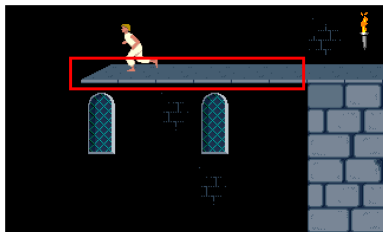

After the player has merged with the shadow, several tiles appear out of thin
air. This happens when the player steps on any type of empty location: in
**room 2**, the **entire top row**; in **room 13**, the **four top right
tiles**.

### 8.4 Next Section

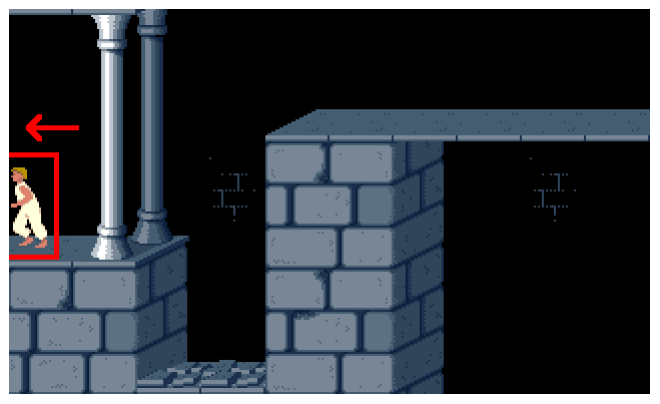

As soon as the player moves to **room 23** from any other room, level 12b (13)
will start.

## 9. Level 12b (13)

### 9.1 Falling Tiles

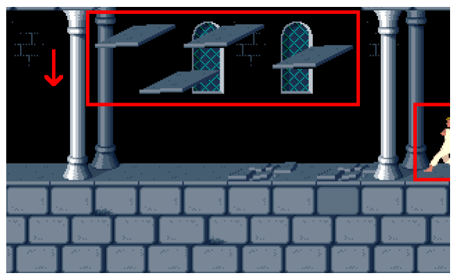

In level 12b (13), the **six middle tiles above rooms 16 and 23** will fall down
when the player enters these rooms. This only happens if they are loose tiles.
The loose tiles do not shake if the player jumps in that row. If one or more of
these tiles are gates, they are being opened *instantly*. Chompers will chomp
and then have blood on them. Walls become unavailable resources. Certain potions
turn into regular red potions. Level exit doors open. Spikes come out.

This is the only level where falling loose tiles hurt the prince when he's
running.

The player makes a one-tile running entry towards the location he or she is
facing, provided that it's not a falling start. Upon starting this level, the
prince's hit points are (health is) *not* being regenerated, and the level
number and remaining time are *not* shown.[^8]

There is no music when the prince enters the level exit door.

### 9.2 Meeting Jaffar

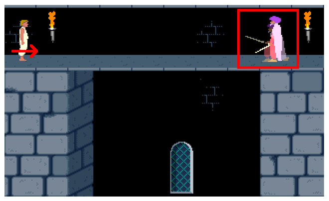

*Every time* the prince **leaves room 3 to the right** in **any row** and Jaffar
is still alive, a tune is played and Jaffar waits (28/12 ≈ 2.3) seconds before
taking his fighting pose.

### 9.3 Jaffar's Death

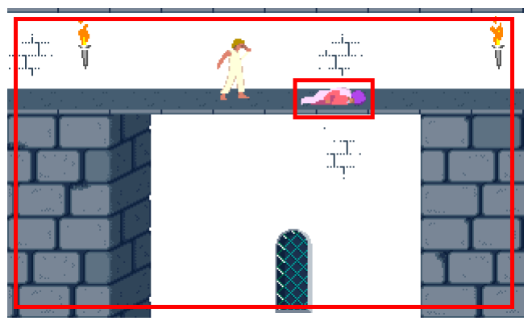

The screen flashes when Jaffar dies. That is, several times, all black pixels
temporarily become white. The game then also displays the remaining time. When
Jaffar is dead, the prince can use *any* level exit door[^9] and the 60 minute
countdown stops.

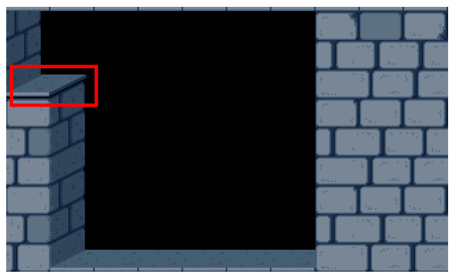

After Jaffar has died, entering any room from the right will activate the **top
left tile** in **room 24**.[^10]

## 10. Final Level

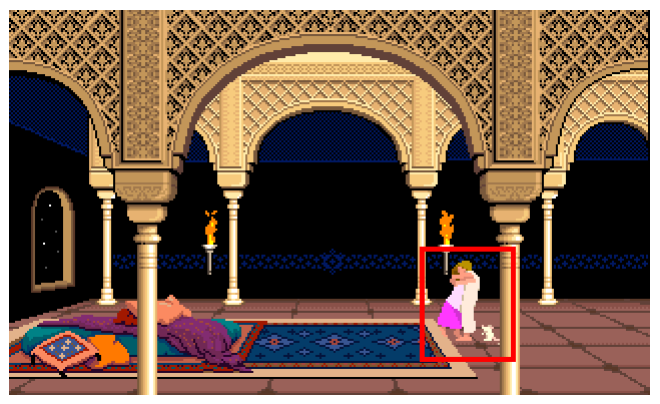

The game ends after the player moves to **room 5** from any other room, or if
the player starts in aforementioned room. The 60 minute countdown is *not*
active this level. If the prince dies in this level, restarting the level is
*not* enough to stop the "Press Button to Continue" countdown.

## 11. Potions Level

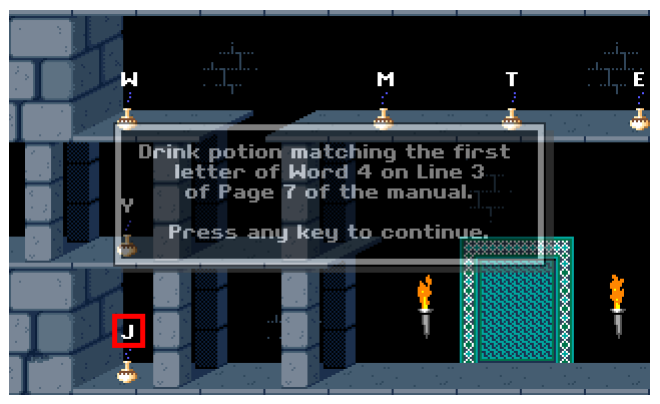

Letters appear. One of the potions is automatically being changed into a
*special* blue potion that activates the **upper left tile** in **room 8**.[^11]
Each *regular* blue potions takes half of the player's total hitpoints instead
of just one hitpoint. If the prince dies on this level, there is no death music,
nor a "Press Button to Continue" message. Ctrl+a does not work in this level.

There is no music when the prince enters the level exit door.

## 12. Demo Level

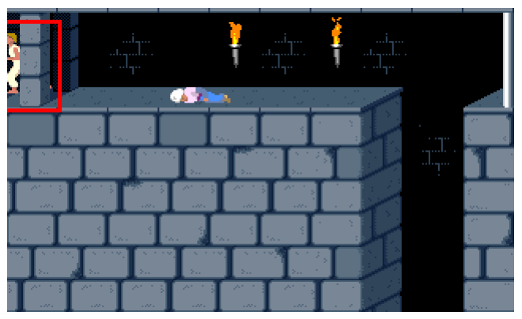

The demo ends when the player (dies or) **enters room 24** from any direction.
If the prince dies on this level, there is no death music, nor a "Press Button
to Continue" message.

## Afterword

If you have any suggestions to further improve this document, please let us know
in this forum thread:
<http://forum.princed.org/viewtopic.php?f=73&t=3151>

## Credits

| Date | Change |
| --- | --- |
| July 12, 2012 | Initial version, by Norbert. |
| July 14, 2012 | Updated by Norbert, to include several additions and corrections by David from the Princed Forum. |
| August 29, 2013 | Updated by Norbert, to include several additions and corrections by tacosalad and David from the Princed Forum. |
| August 7, 2015 | Updated by Norbert, to include some additions and corrections by David, plus one thing mentioned by xhul. Also, URLs are now clickable. |

[^1]: <http://www.popot.org/other_useful_tools.php?tool=CusPop_and_CusAsm>
[^2]: <http://forum.princed.org/viewtopic.php?f=73&t=3151>
[^3]: Walls become plain walls. Floors become floors with wall patterns. Potions
    become regular healing potions. Gates becomes partially open gates. Spikes
    become harmless, but cause drawing glitches. Chompers are unaffected, except
    the closed (stuck) chomper which will open (start working). Raise and drop
    buttons become assigned to event 43 (44 in apoplexy). Tapestries become
    black, but cause drawing glitches. A level exit door opens. A loose tile
    become invisible. A torch will skip a frame.
[^4]: The 2nd tile from the upper left may also be another element with a
    modifier of 0x50 (80) or higher. Even a sword meets this requirement, when
    it blinks.
[^5]: This is because the shadow steps forward with simulated key-presses
    Shift + forward.
[^6]: This can be fixed, as described here:
    <http://forum.princed.org/viewtopic.php?p=13128#p13128>
[^7]: <http://www.popot.org/documentation.php?doc=OverflowBug>
[^8]: This does not apply if the player entered the level with Shift+l or by
    using a level exit door in the previous level. Neither does it apply when
    restarting the level or when loading the level from a saved game.
[^9]: This can be fixed, as described here:
    <http://forum.princed.org/viewtopic.php?p=13128#p13128>
[^10]: If the tile is not a button but its modifier refers to a door event that
    triggers a level door, then the level door will open.
[^11]: It also triggers a drop for the event number determined by the modifier
    of the upper left tile in room 8.
